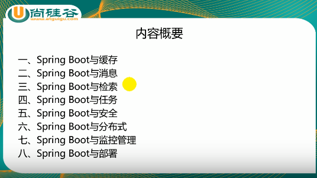
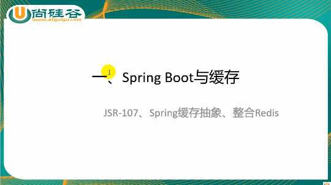
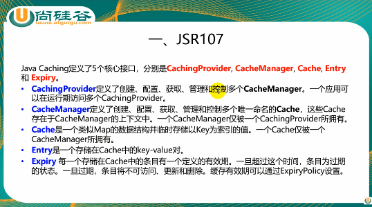
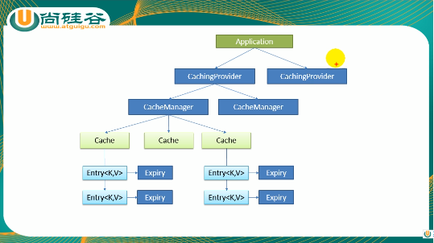
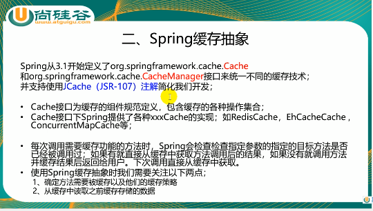
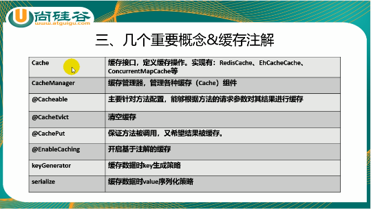

# java-sample-spring-boot-senior

声明：本实例用于个人学习参考。所有内容均参考于网络，由本人手动敲（抄）写。请勿用于商业途径。

```
尚硅谷系列课程 - Spring Boot高级
视频地址：https://www.bilibili.com/video/av36292270
```

### 正文

#### 课程概要



#### 一、Spring Boot与缓存

​	用于优化服务器性能。



##### 1. JSR107缓存协议

1-1. 基本概念



1-2. 结构图



​	但由于JSR107很复杂，我们还是用Spring的缓存抽象。

##### 2. Spring缓存抽象

2-1. 基本概念



2-2. 核心概念



##### 3. 缓存的基本用法

